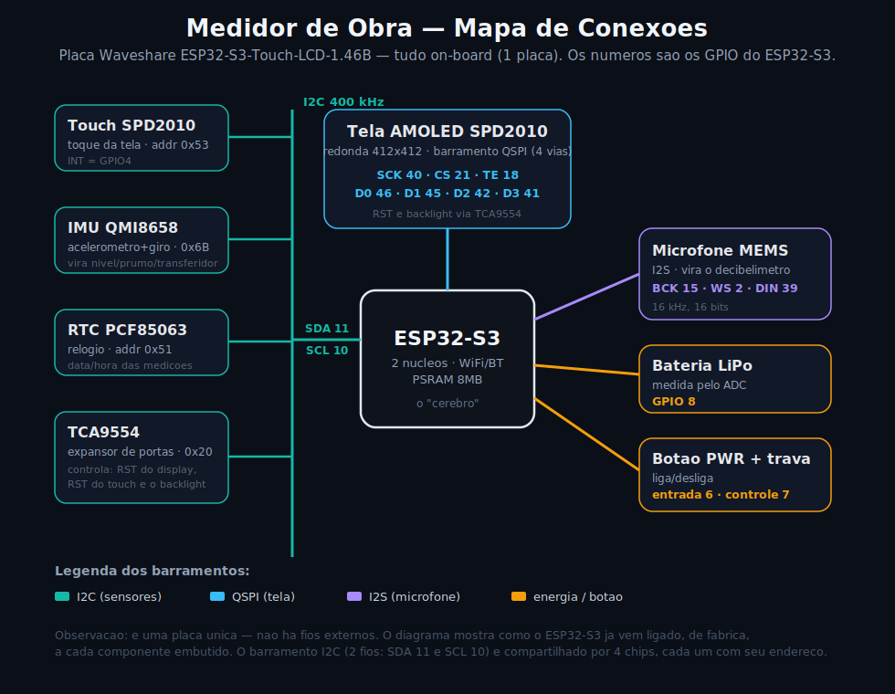

# 📐 Medidor de Obra

**Caixa de ferramentas de obra de bolso numa telinha redonda sensível ao toque
(ESP32-S3).** São **nove ferramentas de medição** — nível, prumo, declividade (%),
transferidor, decibelímetro, conversor, esquadro, planeza e perfil — todas
calculadas a partir dos sensores que já vêm na placa. Você ainda **salva as
medições** com data/hora (na memória **e no cartão SD**), abre um **WiFi próprio**
para ver e baixar tudo no celular, calcula a **insolação solar** (carta solar) de
qualquer local, faz **contas de obra** e desenha um **croqui** — **100% offline,
sem internet**.

Firmware Arduino (C/C++) para a placa **Waveshare ESP32-S3-Touch-LCD-1.46B**
(tela redonda AMOLED 412×412 com toque, IMU QMI8658, microfone I2S, saída de
áudio I2S, relógio PCF85063, cartão SD e WiFi).

Desenvolvido por **Murillo Vinícius** e **Amanda Célia Aparecida da Silva** ·
Centro Universitário **Belas Artes** de São Paulo (FEBASP).

> 👉 Não é da área de eletrônica/programação? Comece pelo
> **[docs/COMO_USAR.md](docs/COMO_USAR.md)** — guia ilustrado de uso, passo a
> passo, com imagens de cada tela.

---

## ✨ O que faz

As **9 ferramentas** ficam num **menu carrossel** (são 12 cartas — arraste de lado
/ *swipe* — e clique para abrir). Cada ferramenta mostra a leitura grande no
centro, uma **barra de status** no topo (hora do relógio interno + % de bateria) e
os botões **MENU · ZERAR · HOLD · SALVAR**.

| Ferramenta | Para que serve | Unidade |
|---|---|---|
| **Nível** | bolha 2D para nivelar piso, laje, móvel | graus |
| **Prumo** | conferir se parede/pilar está na vertical | graus |
| **Declividade (%)** | caimento de rampa, telhado, tubo, calha — com **checagem de norma** (toque no texto azul para trocar) que fica **verde (dentro)** ou **vermelho (fora)** | % |
| **Transferidor** | medir o ângulo entre duas superfícies | graus |
| **Ruído (dB)** | decibelímetro pelo microfone da placa, com **mín/máx** e faixas inspiradas na NR-15 | dB |
| **Conversor** | mostra a mesma inclinação em **graus, %, proporção 1:X e mm/m** ao mesmo tempo | vários |
| **Esquadro** | mira os **90°** entre duas faces — fica **verde** quando a quina está reta | graus |
| **Planeza** | passe na superfície e ele mostra o **desvio (máx − mín)** para detectar empeno/barriga | graus |
| **Perfil** | caimento (%) ao percorrer uma superfície, com **mín / máx / média** | % |

E mais **três cartões** no menu:

- **🌞 SOL (carta solar):** desenha a **cúpula do céu** (carta solar polar) na
  própria tela do ESP, com o caminho do sol no dia e a posição do sol agora (lida
  do relógio interno). Veja `src/SunApp.cpp` + `src/Sun.cpp`.
- **📶 DADOS / WiFi:** instruções na tela para conectar o celular e ver/baixar as
  medições.
- **⚙️ AJUSTES:** brilho da tela, **calibração do decibelímetro** (referência em
  dB), **inverter a bolha** nos eixos X/Y, **bip de nível** ligado/desligado e
  **CAL** — calibração do zero do nível (apoie a placa numa superfície plana).

### Salvar medições (RAM + cartão SD)

O botão **SALVAR** grava a medição na memória (visível na página WiFi) **e também
no cartão SD**, no arquivo `/medicoes.csv` (`data, hora, função, valor, unidade`)
— registro permanente que você leva no cartão.
Veja `src/DataLog.cpp` + `src/SD_Card.cpp`.

### Assistente sonoro (bip de nível)

No **Nível** e no **Prumo**, a placa emite um **bip pela saída de áudio I2S** que
**acelera conforme você se aproxima do nível** (e fica mais agudo quando está
nivelado). Pode ser desligado em AJUSTES. Veja `src/Beep.cpp`.

### Checagem de norma na declividade

A ferramenta de declividade traz *presets* prontos (toque no texto azul para
trocar). São **guias** — confira sempre a norma vigente:

| Preset | Limite |
|---|---|
| Rampa NBR 9050 | até 8,33 % |
| Piso p/ ralo | 0,5 – 2 % |
| Esgoto 100 mm | mín. 1 % |
| Água pluvial | mín. 0,5 % |
| Laje impermeabilizada | mín. 1 % |
| Livre | sem limite |

---

## 🧰 Hardware

**Placa: Waveshare ESP32-S3-Touch-LCD-1.46B** — nenhum sensor extra é necessário,
tudo usa o que já vem na placa.

| Recurso | Componente | Papel no projeto |
|---|---|---|
| Tela redonda AMOLED 412×412 + toque | SPD2010 (barramento QSPI / I²C `0x53`) | toda a interface |
| Acelerômetro + giroscópio | IMU QMI8658 (I²C `0x6B`) | nível, prumo, declividade, transferidor, conversor, esquadro, planeza e perfil |
| Microfone MEMS | I2S (BCK 15 · WS 2 · DIN 39) | o decibelímetro |
| Saída de áudio | PCM5101 via I2S (BCLK 48 · WS 38 · DOUT 47) | o bip do assistente de nível |
| Relógio de tempo real | PCF85063 (I²C `0x51`) | carimba as medições com data/hora |
| Cartão de memória | SD em modo MMC 1-bit (CLK 14 · CMD 17 · D0 16) | guarda o `/medicoes.csv` permanente |
| Expansor de I/O | TCA9554 (I²C `0x20`) | reset da tela/toque, *backlight* e linha do SD |
| Energia | botão PWR + leitura de bateria (ADC) | liga/desliga e mostra a % na barra |
| Conectividade | WiFi/Bluetooth, PSRAM 8 MB | portal no celular |



O que a placa **não** tem (bússola, GPS) é fornecido pelo **celular**, através da
página web do Sol.

---

## 🚀 Como gravar

O passo a passo completo (Arduino IDE, configuração da placa, biblioteca) está em
**[docs/LEIA-ME.md](docs/LEIA-ME.md)**. Resumo:

1. **Arduino IDE 2.x** + pacote **`esp32` da Espressif (3.x)**.
2. Biblioteca **LVGL 8.3.x** + o `lv_conf.h` deste projeto.
3. Abrir `NivelDigital.ino`, selecionar **ESP32S3 Dev Module** com **OPI PSRAM /
   16 MB / USB CDC On Boot: Enabled** e clicar em **Upload**.

---

## 🏗️ Como funciona (arquitetura)

```
NivelDigital.ino     -> bring-up da placa, sobe as tarefas e roda o loop principal
 ├─ AppUi.*          -> telas: SPLASH (logo) -> MENU (carrossel 12 cartas) ->
 │                       ferramenta / SOL / DADOS / AJUSTES
 ├─ LevelApp.*       -> as 9 ferramentas (matemática do ângulo + UI da medição)
 ├─ SunApp.* · Sun.* -> carta solar desenhada na tela + astronomia em C
 ├─ Mic_dB.*         -> decibelímetro (lê o microfone I2S e calcula o nível em dB)
 ├─ Beep.*           -> bip de nível pela saída de áudio I2S (task no core 0)
 ├─ DataLog.*        -> medições salvas (RAM + carimbo do RTC)
 ├─ SD_Card.*        -> monta o cartão e grava o /medicoes.csv permanente
 ├─ WebPortal.*      -> cria o WiFi e serve as páginas (dados, /sol, /calc, /croqui)
 ├─ logo_belasartes.c-> o brasão exibido no splash
 └─ drivers Waveshare-> tela, toque, IMU, relógio, I²C, energia, bateria
```

Os **sensores** rodam numa *task* separada no core 0 (`Sensor_Task`, atualiza IMU,
RTC, bateria e botão de energia), enquanto a **interface LVGL** roda toda no
`loop()` no core 1 — porque a LVGL não é *thread-safe*. O **bip** também roda numa
task própria no core 0 para não travar a UI.

**A medição do ângulo** vem do acelerômetro: parado, ele "sente" a gravidade, e a
direção dessa força revela a inclinação:

```
roll  = atan2(ay, az)
pitch = atan2(-ax, √(ay² + az²))
```

A leitura passa por um filtro suave e a declividade em % é `tan(ângulo) × 100`.
O zero pode ser **calibrado** em AJUSTES (apoiando a placa numa superfície plana).

**O decibelímetro** lê blocos do microfone I2S, remove o nível DC, calcula o RMS e
converte para dB. É aproximado e **calibrável na tela de Ajustes** (referência de
dB; cada +1 sobe ~1 dB na leitura).

**O cálculo solar** existe em dois lugares com a mesma matemática (declinação,
equação do tempo, altura e azimute do sol): em **JavaScript no navegador** (página
`/sol`) e em **C** (`Sun.cpp`) para desenhar a carta solar na tela do ESP.

> Detalhe: a tela é **redonda**, então toda a interface fica dentro de um círculo
> seguro — cantos e bordas são cortados pelo vidro.

---

## 📶 Portal WiFi e páginas web

A placa cria a própria rede WiFi (não precisa de roteador):

- **Rede:** `Medidor-Obra`
- **Senha:** `belasartes`
- **Endereço:** `http://192.168.4.1`

### Página principal (`/`)
Leitura **ao vivo** da ferramenta aberta, **tabela** das medições salvas,
**download CSV**, botão **Limpar** e **Acertar relógio** (usa a hora do próprio
celular, via `/settime`).

### Página do Sol (`/sol`)
Todo o cálculo de astronomia roda **offline, no navegador do celular**. Você
informa latitude/longitude, fuso, data, a orientação da fachada e a altura para a
sombra, e a página entrega:

- **Carta solar** (gráfico azimute × altura do sol) com a linha da fachada;
- **Nascer / pôr do sol**, **meio-dia solar** e **duração do dia**;
- **Altura máxima do sol**;
- **Horas de sol direto na fachada** e a **janela de insolação**;
- **Comprimento da sombra ao meio-dia** para uma dada altura;
- **Beiral (brise) para sombrear** — quanto de avanço por metro de janela;
- **Painel solar:** inclinação ótima e melhor orientação;
- **Melhor face** (que pega sol o dia todo) e **melhor orientação dos ambientes**;
- **Máscara de sombreamento:** 12 barras com as horas de sol por mês.

Atalhos: **Usar GPS do celular**, **Bússola do cel** (ajusta a fachada) e o botão
**Mostrar na tela do ESP** — que envia o local/fachada para a placa (rota
`/setsol`) e desenha a carta solar na própria tela.

### Calculadora de Obra (`/calc`)
Contas rápidas, offline: **concreto (m³)**, **tijolos / blocos**, **escada
(Blondel)**, **pintura** e **argamassa (traço)**.

### Croqui / Anotações (`/croqui`)
Anotação do arquiteto em **SVG interativo**: multi-ambientes, **cotas automáticas**
(escala pela grade), *snap*, símbolos de **parede, luz, tomada, interruptor, porta,
janela e texto**, **resumo** (contagem + perímetro) e **exporta o SVG**.

---

## 📁 Estrutura de pastas

```
NivelDigital/
├─ NivelDigital.ino        setup() / loop()
├─ src/                    o aplicativo + drivers da placa
│  ├─ AppUi.*              telas e navegação (LVGL 8)
│  ├─ LevelApp.*           as 9 ferramentas + matemática do acelerômetro
│  ├─ SunApp.* · Sun.*     carta solar na tela + astronomia em C
│  ├─ Mic_dB.*             decibelímetro (I2S)
│  ├─ Beep.*               bip do assistente de nível (áudio I2S)
│  ├─ DataLog.* · SD_Card.* registro das medições (RAM + cartão SD)
│  ├─ WebPortal.*          AP WiFi + páginas HTML (/, /sol, /calc, /croqui)
│  ├─ logo_belasartes.c    brasão do splash
│  └─ drivers Waveshare    Display/Touch SPD2010, I2C, TCA9554, LVGL_Driver,
│                          QMI8658, PCF85063, PWR, BAT...
├─ docs/                   COMO_USAR.md · COMO_FUNCIONA.md · GUIA.md ·
│  ├─ LEIA-ME.md           (como gravar) · diagrama_conexoes.svg
│  └─ img/                 mockups das telas (menu/nivel/prumo/.../sol/croqui.svg)
└─ tools/                  utilitários (logo/ — gerador do brasão)
```

📖 **Saiba mais:** [docs/COMO_USAR.md](docs/COMO_USAR.md) (guia ilustrado de uso) ·
[docs/COMO_FUNCIONA.md](docs/COMO_FUNCIONA.md) (detalhes técnicos) ·
[docs/GUIA.md](docs/GUIA.md) (guia para leigos) ·
[docs/LEIA-ME.md](docs/LEIA-ME.md) (como gravar).

---

## 🙏 Créditos

**Autores:**
- **Murillo Vinícius** — GitHub [@dantazzzz](https://github.com/dantazzzz) · murillovinicius18@gmail.com
- **Amanda Célia Aparecida da Silva**

**Tecnologias de terceiros:**
- Drivers da placa: demos oficiais da [Waveshare](https://www.waveshare.com/wiki/ESP32-S3-Touch-LCD-1.46B)
- Interface gráfica: [LVGL](https://lvgl.io) 8.3 (licença MIT)

---

## 📜 Licença

**CC BY-NC 4.0** — uso livre para fins **não comerciais**, desde que **citada a
autoria** (Murillo Vinícius e Amanda Célia Aparecida da Silva). Uso comercial
requer autorização. Ver [LICENSE](LICENSE).
