# 📘 Como usar — passo a passo de cada função

Guia **bem simples** de como usar o Medidor de Obra. Cada função tem uma figura
de exemplo da telinha. 🙂

> As figuras são ilustrações da tela redonda (412×412). Na prática, o número muda
> conforme você mexe no aparelho.

---

## ▶️ Ligando e o menu

Ligue pelo cabo USB-C. Aparece a abertura (logo) e depois o **menu**.

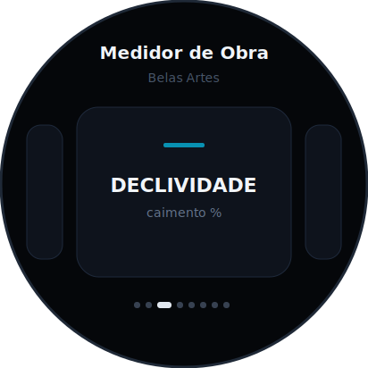

- **Arraste de lado** (como trocar de foto) pra passar pelas ferramentas.
- Os **pontinhos** embaixo mostram em qual você está.
- **Toque** no cartão pra abrir.

São 12 cartões: as 9 ferramentas de medição + **SOL** + **DADOS (WiFi)** + **AJUSTES**.

 

### Os 4 botões (iguais em toda ferramenta)
- **MENU** — volta pro menu
- **ZERAR** — define a posição atual como "zero" (referência)
- **HOLD** — congela o número (pra anotar)
- **SALVAR** — guarda a medição (vai pra lista do WiFi e pro cartão SD)

> No topo aparece a **hora** e a **% de bateria**.

---

## 📐 NÍVEL
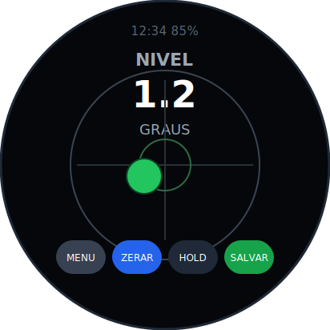

Pra deixar **reto** (piso, laje, móvel, prateleira).

1. Deite o aparelho sobre a superfície.
2. A **bolinha verde** mostra pra onde está inclinado.
3. Quando ela fica no **centro**, está nivelado (aparece "NIVELADO").

 

## 📏 PRUMO
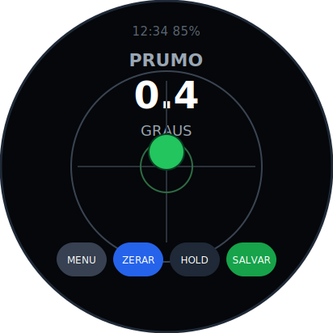

Pra ver se uma **parede/pilar** está "em pé" certinho (na vertical).

1. Encoste o aparelho na parede.
2. A bolinha sobe/desce conforme o desaprumo.
3. No centro = está no prumo.

 

## 📉 DECLIVIDADE (caimento)
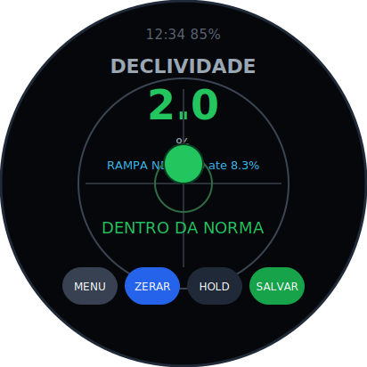

Mostra a inclinação em **porcentagem** (rampa, telhado, cano, calha).

1. Apoie no piso/rampa → aparece o caimento em **%**.
2. **Toque no texto azul** pra escolher a norma (rampa NBR 9050, ralo, esgoto…).
3. Fica **verde "DENTRO DA NORMA"** ou **vermelho "FORA"**.

 

## 📐 TRANSFERIDOR
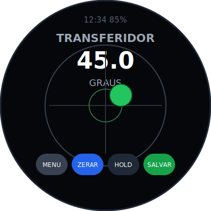

Mede **ângulo** (abertura, canto, peça).

1. Apoie numa face de referência → **ZERAR**.
2. Vá até a outra face → o **ângulo** entre elas aparece no centro.

 

## 🔊 RUÍDO (decibelímetro)
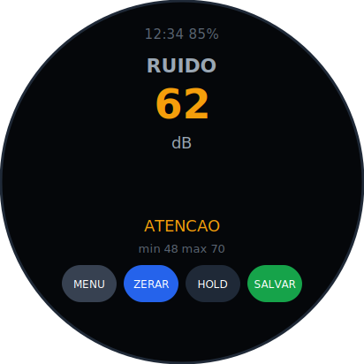

Mede o **barulho** do ambiente em **dB** (usando o microfone da placa).

1. Abra a ferramenta → o número de **dB** aparece.
2. Cor: 🟢 baixo · 🟡 atenção · 🔴 alto (acima de 85, referência NR-15).
3. Mostra **mín/máx**; **ZERAR** reinicia.

 

## 🔁 CONVERSOR de inclinação
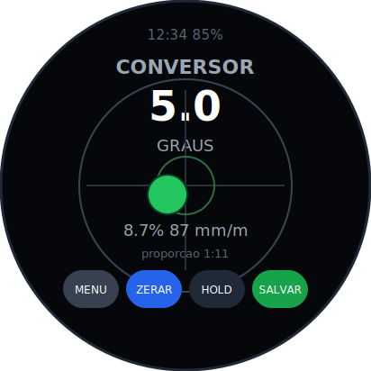

Mostra a **mesma inclinação em todas as unidades** ao mesmo tempo:
**graus, %, mm por metro** e **proporção 1:X**.

1. Incline o aparelho.
2. Leia tudo de uma vez (graus em cima, o resto embaixo).

 

## 📐 ESQUADRO (90°)
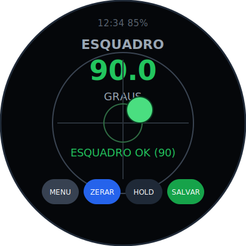

Confere se uma **quina está reta** (90°).

1. Apoie numa face → **ZERAR**.
2. Vá pra face perpendicular.
3. Quando der **90°**, fica **verde "ESQUADRO OK"**.

 

## 📋 PLANEZA / empeno
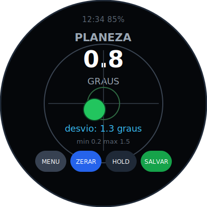

Vê se uma superfície é **plana** (sem barriga/empeno).

1. **ZERAR** num ponto.
2. **Passe o aparelho** pela superfície.
3. Ele mostra o **desvio** (diferença entre o ponto mais alto e o mais baixo).

 

## 📈 PERFIL de caimento
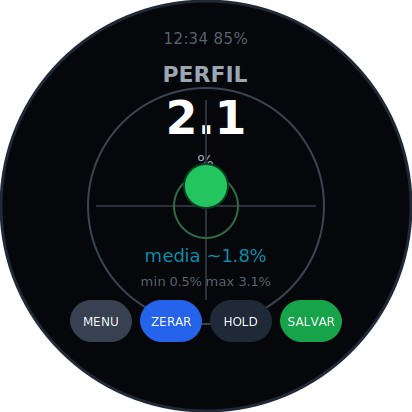

Como a declividade, mas anota a **faixa** de caimento em vários pontos
(**mín / máx / média** em %).

1. Passe o aparelho ao longo do piso/rampa.
2. Veja a **média** e os extremos. **ZERAR** reinicia.

 

## 🌞 SOL (carta solar)
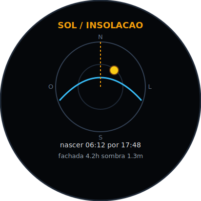

Desenha o **caminho do sol no céu** no dia (a "cúpula" = o céu visto de baixo).

1. A bolinha amarela é o **sol agora** (pela hora do relógio).
2. A linha tracejada é a **fachada**.
3. Embaixo: **nascer/pôr do sol**, horas de sol na fachada e a **sombra**.

> Pra mudar o local/data, use a página do Sol no celular e toque **"Mostrar na
> tela do ESP"** (veja abaixo).

 

## ⚙️ AJUSTES
Tela de configurações:
- **Brilho** (− / +)
- **Calibrar o dB** (− / +) — pra o ruído bater com um app de celular
- **Inverter bolha** (X / Y) — se ela andar pro lado errado
- **CAL** — apoie o aparelho numa superfície **plana** e toque: vira o "zero verdadeiro"
- **Bip** ligado/desligado (o som de nível)

---

## 📱 No celular (WiFi)

1. No celular, conecte na rede **`Medidor-Obra`** (senha **`belasartes`**).
2. Abra o navegador em **`192.168.4.1`**.

Lá você tem:
- **Leitura ao vivo** + **tabela das medições salvas** + **baixar CSV** + **acertar o relógio**.
- **Sol / Insolação** — carta solar, **insolação de fachada**, sombra, **beiral**,
  **painel solar** (inclinação ideal), **melhor orientação** e **horas de sol por mês**.
- **Calculadora de Obra** — concreto (m³), tijolos, **escada (Blondel)**, pintura, argamassa.

### ✏️ Croqui / Anotações (a "prancheta")
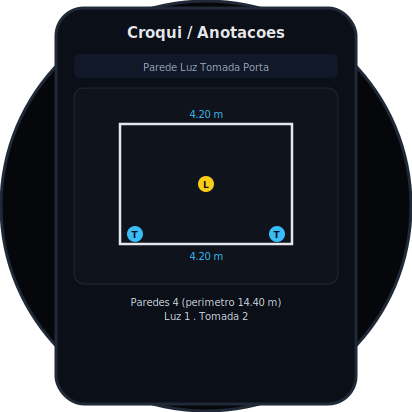

Desenhe o ambiente e anote tudo:

1. Crie um **ambiente** (+ Amb) e dê o nome.
2. Defina a **escala** (ex.: 0,5 m por quadrado).
3. **Parede:** toque início e fim → a **medida aparece sozinha**.
4. **Luz / Tomada / Interruptor / Porta / Janela:** toque pra plantar o símbolo.
5. Veja o **resumo** (perímetro + contagem) e **Exporte o SVG**.

 

---

Dúvida em alguma função? Veja também o **[GUIA.md](GUIA.md)** (explicação geral)
e o **[COMO_FUNCIONA.md](COMO_FUNCIONA.md)** (a conta por trás de cada uma).
